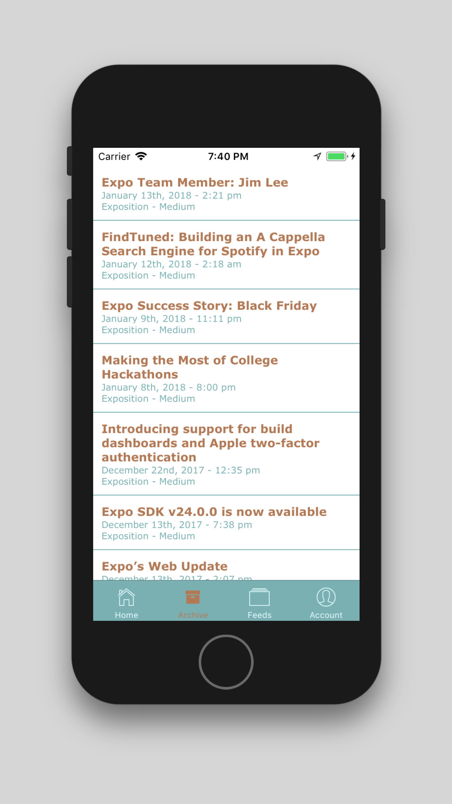
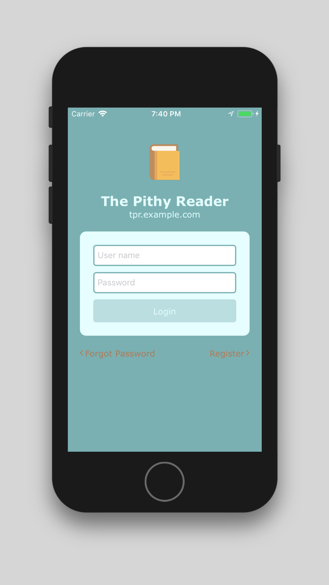
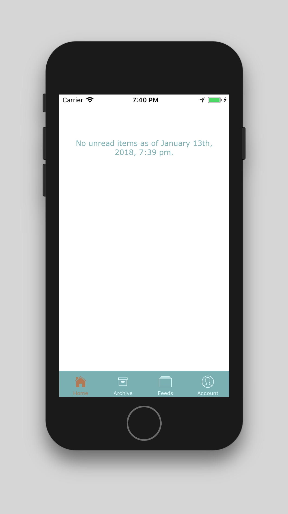

# TPR Mobile

:book: React Native client for https://github.com/jackc/tpr

This project was bootstrapped with [Create React Native App](https://github.com/react-community/create-react-native-app).

You can download the apps from the AppStore or the PlayStore:

  
  

  

    
    
    
  

